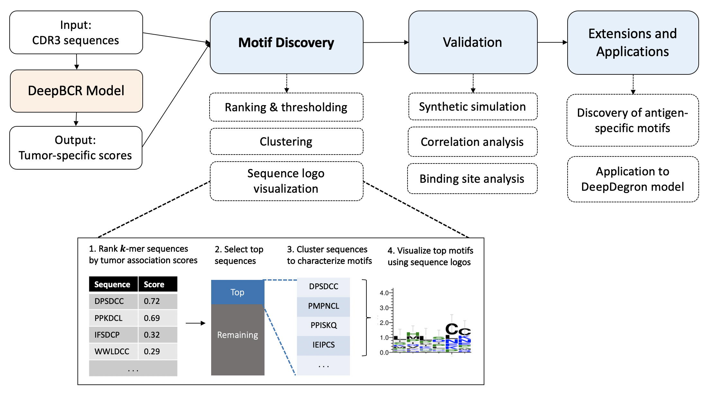
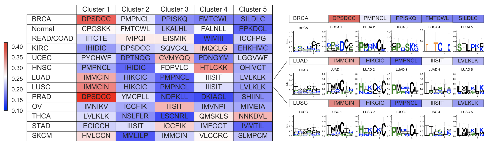

## Decoding Neural Networks: Novel Computational Methods to Discover Anti-Tumor B-Cell Receptor Binding Motifs
Cynthia Chen

Mentors: Dr. Sherlock Hu, Dr. Collin Tokheim, Professor Shirley Liu

[Research paper](https://drive.google.com/file/d/1ncd2uYxCjTl2Qi93eE6oOBZQkUFPUoKX/view?usp=share_link).

[AACR abstract](https://aacrjournals.org/cancerres/article/80/16_Supplement/4879/643623/Abstract-4879-Identification-of-degron-motifs-and).

[Molecular Cell paper](https://pubmed.ncbi.nlm.nih.gov/33567269/). 

Deep learning models have been successfully employed for various challenging biological tasks; however, the complexity and depth of neural networks render them black boxes. To address this problem and reveal the important features learned by deep learning models, we developed a novel computational pipeline for decoding neural network models trained on protein sequence data. Our pipeline consists of several stages: generating random input sequences, running the model to rank sequences, clustering top sequences to characterize motifs, and visualizing motif clusters with sequence logos. Using our pipeline, we deciphered the binding motifs learned by a deep learning model trained on a pan-cancer dataset containing more than 30 million B cell receptor (BCR) protein sequences from 5,000 patients. We discovered 65 BCR binding motifs among 13 cancer types and validated the robustness of the motifs through extensive correlation analyses. Our study is the first to reveal and validate anti-tumor BCR binding motifs that target specific tumor antigens, a discovery that is critical to the future synthesis of new antibody drugs for cancer treatments. Furthermore, we demonstrated the versatility of our computational pipeline by using it to decode a second deep learning model, showing that our methods are applicable to a variety of neural networks.

Decoding Pipeline:

B-Cell Receptor Motif Results:

